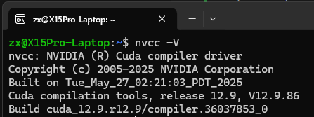

# MyUbuntuConfig

## Init

1. (Optional) Use TUNA repo 
```bash
wget https://tuna.moe/oh-my-tuna/oh-my-tuna.py

sudo python3 oh-my-tuna.py --global
```

2. Install some essential pkgs
```bash
sudo apt update && sudo apt install build-essential pkg-config cmake make git screen net-tools curl gcc g++ git wget curl net-tools vim python3 python3-pip openssh-server openssh-client tldr -y
```

3. (OPTIONAL) Install zsh

```bash
sudo apt install zsh -y
sh -c "$(curl -fsSL https://git.io/zinit-install)"
chsh -s $(which zsh)
```

4. (OPTIONAL) Install some fonts
```bash
mkdir -p ~/Downloads/fonts_MesloLGS
cd ~/Downloads/fonts_MesloLGS
wget https://github.com/romkatv/powerlevel10k-media/raw/master/MesloLGS%20NF%20Regular.ttf
wget https://github.com/romkatv/powerlevel10k-media/raw/master/MesloLGS%20NF%20Bold.ttf
wget https://github.com/romkatv/powerlevel10k-media/raw/master/MesloLGS%20NF%20Italic.ttf
wget https://github.com/romkatv/powerlevel10k-media/raw/master/MesloLGS%20NF%20Bold%20Italic.ttf
```

## Install CUDA

* For WSL: [CUDA WSL](https://docs.nvidia.com/cuda/wsl-user-guide/index.html#step-3-set-up-a-linux-development-environment)

* For Ubuntu:

**NOTE:** You **MUST** install open driver (choose MIT / GPL if you use runfile) for RTX 50-series, while non-free driver is recommended for older Nvidia GPU.
Follow the guide from [CUDA 12.8](https://developer.nvidia.com/cuda-12-8-0-download-archive?target_os=Linux&target_arch=x86_64&Distribution=Ubuntu&target_version=24.04&target_type=deb_network):


Add these lines to `.bashrc`
```bash
export PATH="/usr/local/cuda-12/bin:$PATH"
export LD_LIBRARY_PATH="/usr/local/cuda-12/lib64:$LD_LIBRARY_PATH"
```

Then:
```bash
source ~/.bashrc
```

Test with `nvcc -V`:



## Install Conda
See [Conda](https://docs.conda.io/en/latest/)

## (OPTIONAL) Install 1Panel

## Install Docker and Nvidia-docker


[Nvidia-docker](https://docs.nvidia.com/datacenter/cloud-native/container-toolkit/latest/install-guide.html)
